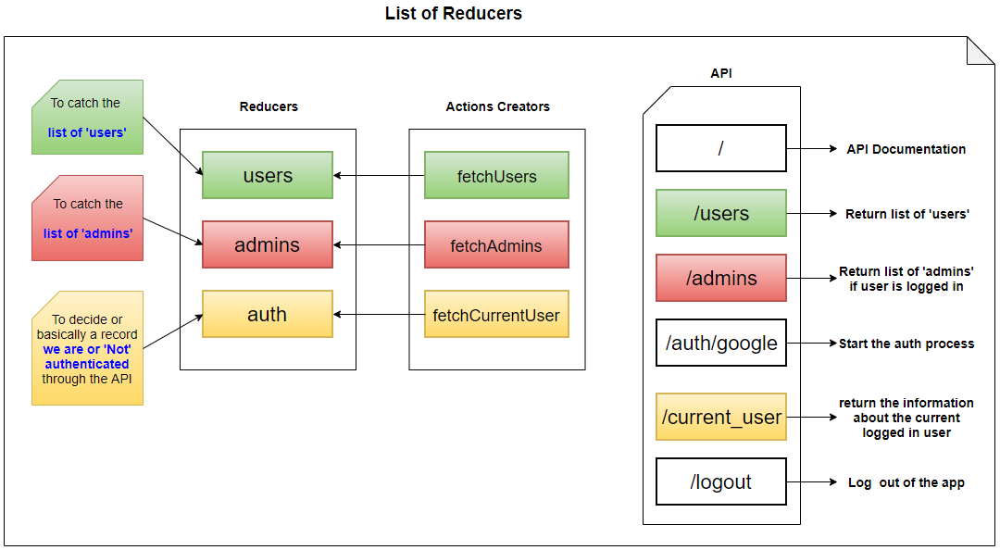
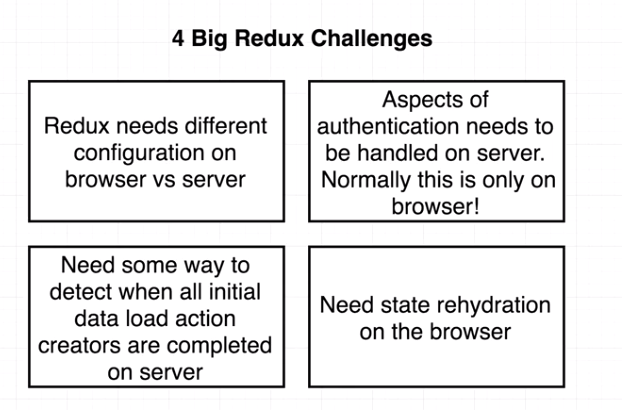
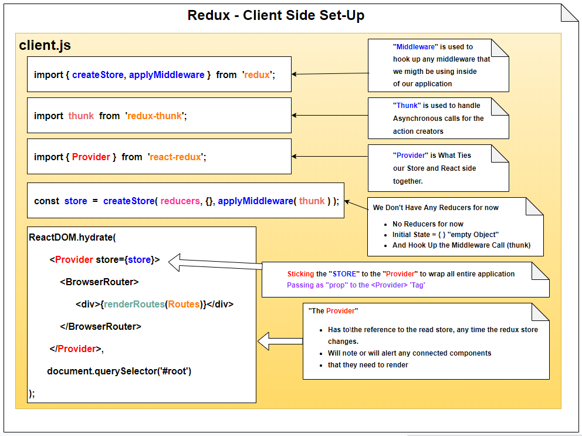
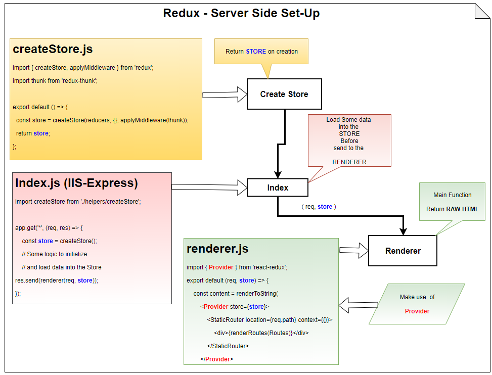

# Server Side Render

You can download this repository by using the green `Clone or Download` button on the right hand side of this page.  
This will present you with the option to either clone the repository using Git, or to download it as a zip file.

If you want to download it using git, copy paste the link that is presented to you, then run the following at your terminal:

```
git clone https://github.com/OsvaldoMartini/My_Webpack_Base_1.git

cd My_Webpack_Base_1

npm install
```

# Render Server Side with React

## Video 23 - Ignoring File with WebpackNodeExternals
````
 So anything that's inside the nome modules folder will not be included inside of our server side bundle.
 
 externals: [webpackNodeExternals()]
````

## Video 24 - Renderer Helper
````

 This helpes to separate out this express related logic inside "index.js"

````

## Video 25 - Implementing React Router Support
````
 New Way to Route wih (Router-ReactConfig)
 React-Router-Config
 It will help Us to figure Out hat set of components are about to be rendered. Give some Particular URL
````
## IIS-Express
````
If wew want to add in some route for some API handlers or some handler that to return some JSON or any outside requests
we might want to take in.

We can certainly add those as routing logic to express (or other Server Side like .Net MVC)
````

## React Router 
````
But anthing that is meant to show HTML out.
We are always going to  ake sure that React-Router is in charge of that request.

````

## Video 26 - BrowserRouter vs StaticRouter

## StaticRouter
This is a special Library from React

````
When we do our initial render of the app it's going to be using
the StaticRouter
````

This can be useful in server-side rendering scenarios when the user isn’t actually clicking around, 
so the location never actually changes. 

Hence, the name: static. It’s also useful in simple tests when you just need to plug in a location and make assertions 
on the render output.

check the sample:
````
Here’s an example node server that sends a 302 status code for <Redirect>s and regular HTML for other requests:
````
https://reacttraining.com/react-router/web/api/StaticRouter


## BrowserRouter
This is a special Library from React
````
When our application gets shipped down to the browser and it gets rendered a second time or "hydrate on the browser"
as we call it.

We will swap out to using the BrowserRouter instead.
````

## Summary About "BrowserRouter vs StaticRouter"
````
We  have one running on the server (StaticRouter)
and another running on the browser (BrowserRouter) 
````

## List of Reducers for our Application



# 4 Big Challenges
 
 I will have 2 (Two) copies of Redux

## 1) First Challenge     
````
 Redux needs different configuration
 on browser vs server
````

## 2) Second Chanllenge 
````
Aspects of authentication needs to be handle on server. 
Normally this is only on browser 
````
## 3) Third Challenge
````
Need some way to detect when all initial data load "action creators" 
are completed on server
````

## 4) Fourth Challenge
````
Need state rehydration on the browser
````



# 1) Solving First Challenge

##  Redux -> Client Side Set-Up  

### "client.js"

* "Middleware" is used to hook up any middleware that we migth be using inside of our application
````
import { createStore, applyMiddleware } from 'redux';
````

 * "Thunk" is used to handle Asynchronous calls for the action creators
````
import thunk from 'redux-thunk';
````

* "Provider" is What Ties our Store and React side together
> Is used to communicate data from the store to any connected components in our application
````
import { Provider } from 'react-redux';
````

* Create New Redux Store to use on the Client Side to Store all our Reducers
````
We Don't Have Any Reducers for now
No Reducers for now
Initial State = { } "empty Object"
And Hook Up the Middleware Call (thunk)

//Creating the first Store

const store = createStore(reducers, {}, applyMiddleware(thunk));

````

* Sticking the "STORE" to the "Provider" to wrap all entire application

>Passing as  "prop" to the <Provider> 'Tag'
````
<Provider store={store}>
````

* "The Provider" has reference to the read store, any time the redux store changes.
* "The Provider" Will note or will alert any connected components that they need to render



##  Redux -> Server Side Set-Up  

### "createStore.js"

> I Only need the store in Server-Side
````
import { createStore, applyMiddleware } from 'redux';
````
* "Thunk" - Takecare about the Asynchronous call for the action creators
````
import thunk from 'redux-thunk'; 
````

* Create Redux Store to use on the SERVER Side
````
We Don't Have Any Reducers for now
Initial State = { } "empty Object"
And Hook Up the Middleware Call (thunk)
````
> Creating the Second Store and Return It.
````
export default () => {
  const store = createStore(reducers, {}, applyMiddleware(thunk));

  return store;
};
````
> I DON'T need the PROVIDER in Server-Side
````
 In Client Side I need the PROVIDER to Dispatch Notices and Alerts 
 for the components to attempt to render
````
### The Challenge is:
````
Some Detection of "When" we finish all of our initial data loading "Before" we attempt to render
````
> BUT I DO NEED the PROVIDER inside of  RENDERER JS BEFORE TO RENDER
````
 Inside to the RENDERER to handle the transformation Data Store to RAW HTML
 ````




# Action Creators
## FETCH_ADMINS
#### "./actions/index.js"
````
/**
|--------------------------------------------------
| Action Creator for List of Admins
|--------------------------------------------------
*/
import axios from 'axios';

export const FETCH_ADMINS = 'fetch_admins';
export const fetchAdmins = () => async dispatch => {
  const res = await axios.get('http://react-ssr-api.herokuapp.com/admins');

  dispatch: ({
    type: FETCH_ADMINS,
    payload: res
  });
};
````
## Reducer to Match with FETCH_ADMINS Action Creator
> This Reducer watch's the FETCH_ADMINS "Action Creator"
### './reducers/adminsReducer.js"
````
/**
|--------------------------------------------------
| Reducer to Watch FETCH_ADMINS Action Creator
|--------------------------------------------------
*/
import { FETCH_ADMINS } from '../actions';

export default (state = [], action) => {
  switch (action.type) {
    case FETCH_ADMINS:
      return action.payload.data;
    default:
      return state;
  }
};
````

# G Suite Toolbox - Dig DNS Dig Tool
https://toolbox.googleapps.com/apps/dig/#AAAA/
## Install:
https://help.dyn.com/how-to-use-binds-dig-tool/
https://www.isc.org/downloads/
### Usage:
```
>dig www.wservices.co.uk +nostats +nocomments +nocmd
>dig www.wservices.co.uk +nostats +nocomments +nocmd
>dig www.wservices.co.uk +nostats +nocomments +nocmd
```
### Videos 49 and 50
Deploymnet of Servers and Node and Webpack Integration

> Making webpack Middleware.
### Creating a Stand Alone Server
```
npm install --save express
```

Install Webpack as  Middleware (For Intercept incoming request and hand it off to webpack)

```
npm install --save-dev webpack-dev-middleware@2.0.6
```
### If you get this error:
```
context.compiler.hooks.invalid.tap('WebpackDevMiddleware', invalid);
```

### These Versions really works together
```
  "webpack": "^2.2.0-rc.0",
  "webpack-dev-middleware": "^2.0.6",
  "webpack-dev-server": "^2.2.0-rc.0"
```

### Tests as PRODUCTION

```
SET NODE_ENV=production
Delete folder 'dist'
node server.js
```

### Adding some Authentication or Databasic Logic or anything like that
It is to Add Additional Route ABOVE .. 
### I meant: "ABOVE"... "ABOVE ALL WEBPACK INFORMATION"
server.js
```
//Servers Routes...

app.get('/hello', (req, res) => res.send({ hi: 'there' }));

if (process.env.NODE_ENV !== 'production') { ...
```
